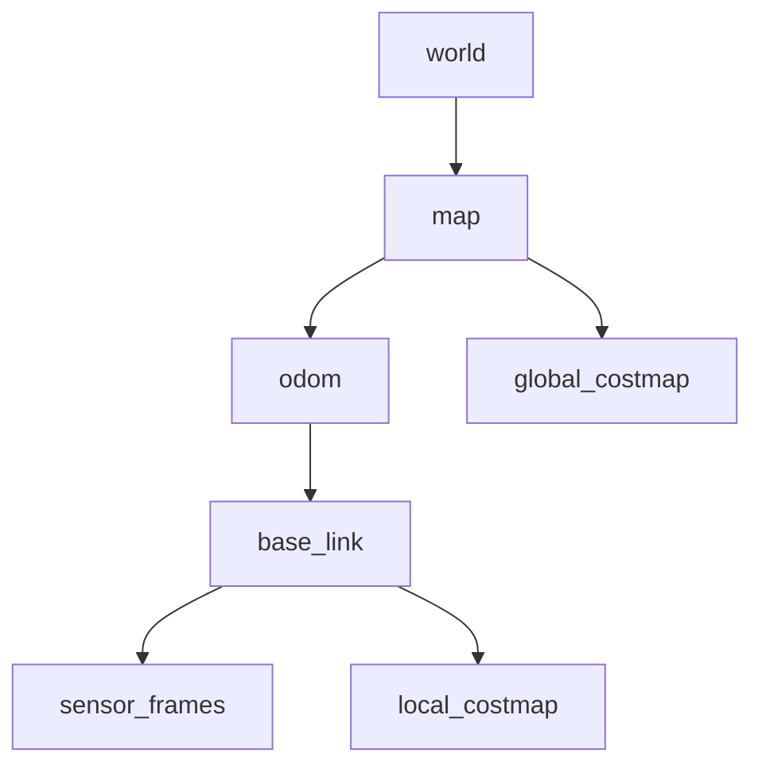

# Shanti 2025 Simulation

A simulation environment for the Shanti 2025 robot using Gazebo and ROS 2.

> **Caution:** This package will not work without following the instructions in the [Setup Instructions](#setup-instructions) section.

> **Caution:** This package will not work without following the instructions in the [Setup Instructions](#setup-instructions) section.

## Table of Contents

- [Overview](#overview)
- [Dependencies](#dependencies)
- [Setup Instructions](#setup-instructions)
- [Gazebo Models](#gazebo-models)
- [Frames in Simulation](#frames-in-simulation)
- [Frame Diagram](#frame-diagram)

## Overview

This package provides simulation tools and environments for testing and developing the Shanti 2025 robot. It integrates with Gazebo and ROS 2 navigation stacks.

## Dependencies

- `robot_localization` package
- Python package: `utm`

To install Python dependencies:

```bash
pip3 install utm
```

To install `robot_localization` (if not already installed):

```bash
sudo apt install ros-${ROS_DISTRO}-robot-localization
```

## Setup Instructions

1. **Move Gazebo Models:**
   Copy the provided models to your Gazebo models directory:

   ```bash
   cp -r ~/ros2_ws/src/Shanti_2025/simulation/worlds/models ~/.gazebo/
   ```

   This ensures Gazebo can find and use the custom models in your simulations.

2. **Build the Workspace:**
   From the root of your ROS 2 workspace:
   ```bash
   colcon build
   source install/setup.bash
   ```

## Frames in Simulation

Simulation adds complexity to the robot's frame transforms. Navigation relies on several key frames:

- **`base_link`**: The robot's main body frame.
- **`map`**: The global reference frame for navigation.
- **`odom`**: The local odometry frame.
- **`local_costmap`** and **`global_costmap`**: Used by the navigation stack.
- **`world`**: The Gazebo simulation world frame.

### Frame Relationships

Below is a diagram showing the relationship between frames in simulation:



- **`sensor_frames`**: Represents any sensors (e.g., lidar, camera) attached to the robot.
- The **`world`** frame is only present in simulation and serves as the root for all other frames.

---

## Current Frames

Latitude / Longitude to UTM Conversion
0.00001 degrees ~= 1 meter

Oakland:

|           | Value     |
| --------- | --------- |
| Latitude  | 42.66791  |
| Longitude | -83.21958 |
| Eastings  | 318110.7  |
| Northings | 4726326.2 |

Most of Michigan is in UTM zone 17 T, and WGS 84 is the defualt standard

California:

|           | Value       |
| --------- | ----------- |
| Latitude  | 38.161479   |
| Longitude | -122.454630 |
| Eastings  | 547777.0    |
| Northings | 4223872.2   |

California is in UTM zone 10 T

Feel free to contribute or open issues for improvements!
